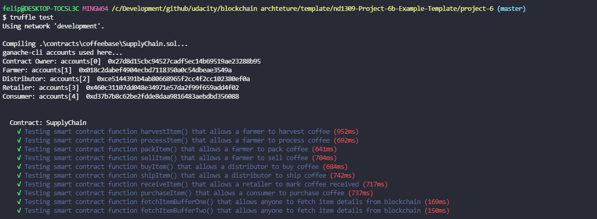
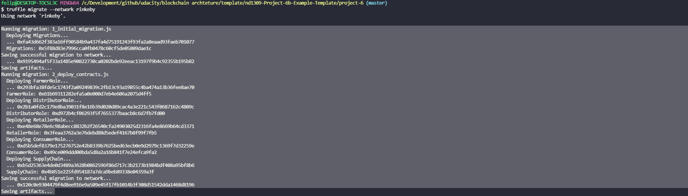

# Read.me

### Libraries
node v12.14.1
truffle-assertions was used for testing events
truffle-hdwallet-provider was used for being able to deploy using infura + truffle
Solidity v0.5.16 (solc-js) was used to develop smart contracts
truffle v5.4.8 (core: 5.4.8) was used to provide a development env, testing framework, and asset pipeline for Ethereum.
web3.js v1.5.2 was used to interact with a ethereum node using HTTP, IPC or WebSocket.

### Running the tests
1) Change directories into the project-6 folder
2) In the terminal run  `truffle develop`
3) The terminal will display `truffle(develop)>`
4) at that prompt enter `test` 
5) You will see it compile the contracts and then run the associated unit tests. There will be 10 passing tests.

### Running the front end
1) Change directories into the project-6 folder
2) In one terminal run  `truffle develop`
3) In metamask ensure you have a connection to truffles server on port 9545
4) Import one of the private keys to setup metamask with an account that has eth
5) In another terminal run `npm run dev`
6) The local UI will display (if not navigate to `localhost:3000`)

### UML
Located in UML folder

### Contract Address

[contract address is 0x120c0e9304479f4d8ee916e9a509e45f17fb1014b3f308d51542dda1468d8196](https://rinkeby.etherscan.io/tx/0x120c0e9304479f4d8ee916e9a509e45f17fb1014b3f308d51542dda1468d8196)

### Full prompt

`
Running migration: 1_initial_migration.js
  Deploying Migrations...
  ... 0xfa43d662f383a16ff90584b9a437fa4d75191243f93fa2a8eaad93faeb701077
  Migrations: 0x5f88d83e7996cca0fb0478c60cf5de05809dae1c
Saving successful migration to network...
  ... 0x9195494af5f33a1485e90822730ca0202bde92eeac13197f9b4c92355b195b82
Saving artifacts...
Running migration: 2_deploy_contracts.js
  Deploying FarmerRole...
  ... 0x293bfa38fde5c1743f2a09249839c2fb13c93a19855c4ba474a13b36fee8ae70
  FarmerRole: 0x61b69311282efa5a0e000d7eb4e606a2075d4ff5
  Deploying DistributorRole...
  ... 0x2b1a0fd2c179e8ba39031f8e16b39d020d89cac4a3e221c543f0687162c4809c
  DistributorRole: 0xd972b4cf06293f5f7655377baacb8c6d7fb7fd00
  Deploying RetailerRole...
  ... 0xe48e68e78e6c98abecc8832b2f26540cfa24903025d2316fa4e8669b64cd3371
  RetailerRole: 0x3feaa3762a3e76debd88d5edef4167b8f99f7fb5
  Deploying ConsumerRole...
  ... 0xd5b5def8379e175276752e42b8339b7625bed63ecb0e9d2979c1369f7d32259e
  ConsumerRole: 0x49ce009ddd00bda5d8a2a16b841f7e24efca9fa2
  Deploying SupplyChain...
  ... 0xb5d25363e4de0d3489a3628b0862596f86d717c3b2173b1984bdf408a95bf8b6
  SupplyChain: 0x4b851e225fd954187a7dca9beb89338e04359a3f
Saving successful migration to network...
  ... 0x120c0e9304479f4d8ee916e9a509e45f17fb1014b3f308d51542dda1468d8196
Saving artifacts...
`# supply-chain
